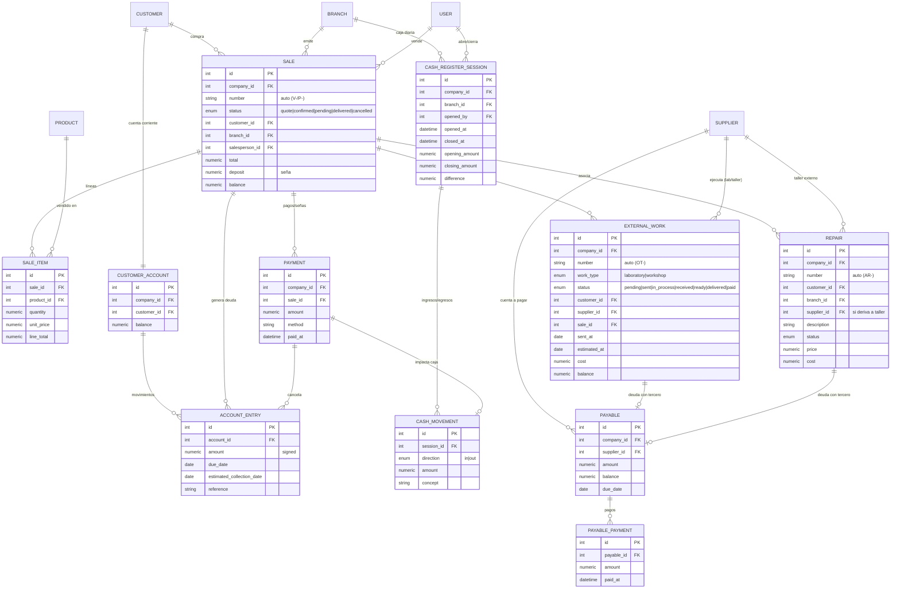

# SGI Óptica — Modelo de datos (ER) · 14 módulos

Diagrama entidad-relación del sistema completo. Las entidades **implementadas en
esta sesión** (master-data backbone) están marcadas con ✅; las **transaccionales
planificadas** (fuera de alcance por ahora) con 🟡. Todas las tablas de negocio
llevan `company_id` (multi-tenant ready) y, donde aplica, `is_active`
(eliminación lógica), más auditoría vía `change_history` y numeración automática
vía `number_sequence`.

## Módulos

| # | Módulo | Estado | Entidades principales |
|---|--------|--------|-----------------------|
| 1 | Configuración / Empresa | ✅ | `company`, `company_settings` |
| 2 | Usuarios y permisos (RBAC) | ✅ | `user`, `role`, `permission`, `user_roles`, `role_permissions` |
| 3 | Sucursales | ✅ | `branch` |
| 4 | Proveedores / terceros | ✅ | `supplier` (mercadería/laboratorio/taller) |
| 5 | Productos y stock | ✅ | `product_type`, `brand`, `product`, `stock_level`, `stock_movement` |
| 6 | Precios y costos | ✅ | `price_category`, `price_list`, `price_list_item`, `cost_history` |
| 7 | Clientes | ✅ | `customer`, `prescription`, `treatment_history` |
| 8 | Ventas | 🟡 | `sale`, `sale_item`, `payment` |
| 9 | Caja | 🟡 | `cash_register_session`, `cash_movement` |
| 10 | Cuentas corrientes (clientes) | 🟡 | `customer_account`, `account_entry` |
| 11 | Trabajos externos (lab/taller) | 🟡 | `external_work` |
| 12 | Arreglos / servicios | 🟡 | `repair` |
| 13 | Cuentas a pagar (terceros) | 🟡 | `payable`, `payable_payment` |
| 14 | Reportes / Dashboard | 🟡 | (vistas/agregaciones, sin tablas propias) |

Infraestructura transversal (✅): `change_history` (historial de cambios),
`number_sequence` (numeración automática). Importación masiva y impresión/export
(🟡) son funciones transversales sin esquema propio relevante.

## Diagrama (implementado — master-data backbone) ✅

```mermaid
erDiagram
    COMPANY ||--|| COMPANY_SETTINGS : "configura"
    COMPANY ||--o{ USER : "emplea"
    COMPANY ||--o{ ROLE : "define"
    COMPANY ||--o{ BRANCH : "tiene"
    COMPANY ||--o{ SUPPLIER : "trabaja con"
    COMPANY ||--o{ PRODUCT_TYPE : "clasifica"
    COMPANY ||--o{ BRAND : "registra"
    COMPANY ||--o{ PRODUCT : "cataloga"
    COMPANY ||--o{ PRICE_CATEGORY : "define"
    COMPANY ||--o{ PRICE_LIST : "publica"
    COMPANY ||--o{ CUSTOMER : "atiende"
    COMPANY ||--o{ CHANGE_HISTORY : "audita"
    COMPANY ||--o{ NUMBER_SEQUENCE : "numera"

    USER }o--o{ ROLE : "user_roles"
    ROLE }o--o{ PERMISSION : "role_permissions"
    USER }o--|| BRANCH : "asignado a"

    PRODUCT }o--|| PRODUCT_TYPE : "es de tipo"
    PRODUCT }o--o| BRAND : "de marca"
    PRODUCT }o--o| SUPPLIER : "provisto por"
    PRODUCT }o--o| PRICE_CATEGORY : "categoría precio"
    PRODUCT ||--o{ COST_HISTORY : "historial costo"
    PRODUCT ||--o{ STOCK_LEVEL : "stock por sucursal"
    PRODUCT ||--o{ STOCK_MOVEMENT : "movimientos"

    BRANCH ||--o{ STOCK_LEVEL : "almacena"
    BRANCH ||--o{ STOCK_MOVEMENT : "registra"

    PRICE_LIST ||--o{ PRICE_LIST_ITEM : "tiene"
    PRICE_CATEGORY ||--o{ PRICE_LIST_ITEM : "precio por categoría"
    PRICE_LIST }o--o| PRODUCT_TYPE : "acotada a tipo"

    CUSTOMER ||--o{ PRESCRIPTION : "recetas"
    CUSTOMER ||--o{ TREATMENT_HISTORY : "tratamientos"

    COMPANY {
        int id PK
        string name
        string legal_name
        string tax_id "CUIT"
        string currency
        bool is_active
    }
    COMPANY_SETTINGS {
        int id PK
        int company_id FK
        string currency
        string timezone
        bool allow_negative_stock
        int default_branch_id FK
        int default_price_list_id FK
        bool low_stock_alerts_enabled
    }
    USER {
        int id PK
        int company_id FK
        string email UK
        string full_name
        string hashed_password
        bool is_superuser
        int branch_id FK
        bool is_active
    }
    ROLE {
        int id PK
        int company_id FK
        string name UK
        string description
        bool is_active
    }
    PERMISSION {
        int id PK
        string code UK
        string name
    }
    BRANCH {
        int id PK
        int company_id FK
        string name
        string code UK
        string address
    }
    SUPPLIER {
        int id PK
        int company_id FK
        string name
        enum supplier_type "merchandise|laboratory|workshop"
        string tax_id
        bool is_active
    }
    PRODUCT_TYPE {
        int id PK
        int company_id FK
        string name UK
    }
    BRAND {
        int id PK
        int company_id FK
        string name UK
    }
    PRODUCT {
        int id PK
        int company_id FK
        string code UK
        string name
        string model
        string color
        int product_type_id FK
        int brand_id FK
        int supplier_id FK
        int price_category_id FK
        numeric current_cost
        numeric min_stock
        bool is_active
    }
    PRICE_CATEGORY {
        int id PK
        int company_id FK
        string name UK
        bool is_active
    }
    PRICE_LIST {
        int id PK
        int company_id FK
        string name UK
        int product_type_id FK
        bool is_default
        bool is_active
    }
    PRICE_LIST_ITEM {
        int id PK
        int company_id FK
        int price_list_id FK
        int price_category_id FK
        numeric price
    }
    COST_HISTORY {
        int id PK
        int company_id FK
        int product_id FK
        numeric old_cost
        numeric new_cost
        int changed_by_user_id FK
        datetime changed_at
    }
    STOCK_LEVEL {
        int id PK
        int company_id FK
        int product_id FK
        int branch_id FK
        numeric quantity
        numeric min_stock
    }
    STOCK_MOVEMENT {
        int id PK
        int company_id FK
        int product_id FK
        int branch_id FK
        enum movement_type "inbound|outbound|adjustment|transfer"
        numeric quantity "signed delta"
        numeric resulting_quantity
        int counterpart_branch_id FK
        string reference
        int created_by_user_id FK
        datetime created_at
    }
    CUSTOMER {
        int id PK
        int company_id FK
        string first_name
        string last_name
        string document_number
        string phone
        bool is_active
    }
    PRESCRIPTION {
        int id PK
        int company_id FK
        int customer_id FK
        date prescribed_at
        string doctor_name
        numeric right_sphere
        numeric right_cylinder
        int right_axis
        numeric left_sphere
        numeric left_cylinder
        int left_axis
        numeric pupillary_distance
    }
    TREATMENT_HISTORY {
        int id PK
        int company_id FK
        int customer_id FK
        enum treatment_type "myopia|astigmatism|hyperopia|presbyopia|other"
        date diagnosed_at
    }
    CHANGE_HISTORY {
        int id PK
        int company_id FK
        string entity_type
        int entity_id
        string field_name
        string old_value
        string new_value
        int changed_by_user_id FK
        datetime changed_at
    }
    NUMBER_SEQUENCE {
        int id PK
        int company_id FK
        string key UK "sale|quote|work_order|repair"
        string prefix
        int next_value
        int padding
    }
```

## Diagrama (transaccional — planificado) 🟡

Estas entidades **no** están implementadas todavía; se incluyen para fijar el
diseño objetivo y las dependencias. Se conectan a las entidades ✅ ya existentes.

## Notas de diseño

- **Precios por categoría**: el precio de venta de un producto se resuelve por su
  `price_category_id` contra el `price_list_item` de la lista activa. Único por
  (lista, categoría) → "el precio por categoría es único por empresa".
- **Stock**: nunca se edita `stock_level` directamente. Todo cambio pasa por el
  servicio de stock que escribe `stock_movement` y actualiza `stock_level` en la
  misma transacción. Las transferencias generan dos movimientos `transfer`.
- **Numeración**: ventas/presupuestos/órdenes/arreglos usan `number_sequence`
  (prefijos `V-`, `P-`, `OT-`, `AR-`).
- **Auditoría**: cambios de precio, costo, categoría y stock se registran en
  `change_history` (valor anterior/nuevo, usuario, fecha).
