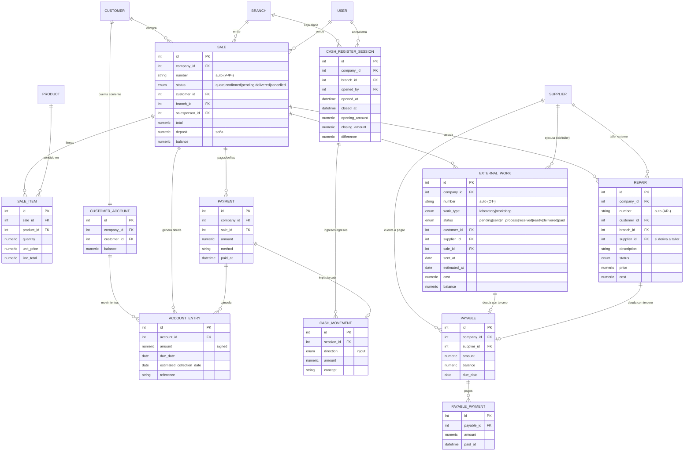

# SGI Óptica — Modelo de datos (ER) · 14 módulos

Diagrama entidad-relación del sistema completo. Las entidades **implementadas en
esta sesión** (master-data backbone) están marcadas con ✅; las **transaccionales
planificadas** (fuera de alcance por ahora) con 🟡. Todas las tablas de negocio
llevan `company_id` (multi-tenant ready) y, donde aplica, `is_active`
(eliminación lógica), más auditoría vía `change_history` y numeración automática
vía `number_sequence`.

## Módulos

| # | Módulo | Estado | Entidades principales |
|---|--------|--------|-----------------------|
| 1 | Configuración / Empresa | ✅ | `company`, `company_settings` |
| 2 | Usuarios y permisos (RBAC) | ✅ | `user`, `role`, `permission`, `user_roles`, `role_permissions` |
| 3 | Sucursales | ✅ | `branch` |
| 4 | Proveedores / terceros | ✅ | `supplier` (mercadería/laboratorio/taller) |
| 5 | Productos y stock | ✅ | `product_type`, `brand`, `product_model`, `product`, `supplier_brands`, `stock_level`, `stock_movement` |
| 6 | Precios y costos | ✅ | `price_list`, `price_category` (escalera AA..ZZ), `cost_history` |
| 7 | Clientes | ✅ | `customer`, `prescription`, `treatment_history` |
| 8 | Ventas | ✅ | `sale`, `sale_item`, `sale_payment`, `payment_account` |
| 9 | Caja | 🟡 | `cash_register_session`, `cash_movement` |
| 10 | Cuentas corrientes (clientes) | 🟡 | `customer_account`, `account_entry` |
| 11 | Trabajos externos (lab/taller) | 🟡 | `external_work` |
| 12 | Arreglos / servicios | 🟡 | `repair` |
| 13 | Cuentas a pagar (terceros) | 🟡 | `payable`, `payable_payment` |
| 14 | Reportes / Dashboard | 🟡 | (vistas/agregaciones, sin tablas propias) |

Infraestructura transversal (✅): `change_history` (historial de cambios),
`number_sequence` (numeración automática), `import_batch` (importación masiva
desde Excel/CSV). Impresión/export (🟡) sigue pendiente.

## Diagrama (implementado — master-data backbone) ✅

```mermaid
erDiagram
    COMPANY ||--|| COMPANY_SETTINGS : "configura"
    COMPANY ||--o{ USER : "emplea"
    COMPANY ||--o{ ROLE : "define"
    COMPANY ||--o{ BRANCH : "tiene"
    COMPANY ||--o{ SUPPLIER : "trabaja con"
    COMPANY ||--o{ PRODUCT_TYPE : "clasifica"
    COMPANY ||--o{ BRAND : "registra"
    COMPANY ||--o{ PRODUCT : "cataloga"
    COMPANY ||--o{ PRICE_LIST : "publica"
    COMPANY ||--o{ CUSTOMER : "atiende"
    COMPANY ||--o{ CHANGE_HISTORY : "audita"
    COMPANY ||--o{ NUMBER_SEQUENCE : "numera"

    USER }o--o{ ROLE : "user_roles"
    ROLE }o--o{ PERMISSION : "role_permissions"
    USER }o--|| BRANCH : "asignado a"

    PRODUCT }o--|| PRODUCT_TYPE : "es de tipo"
    PRODUCT }o--o| BRAND : "de marca"
    PRODUCT }o--o| PRODUCT_MODEL : "modelo / forma"
    PRODUCT }o--o| SUPPLIER : "provisto por"
    PRODUCT }o--o| PRICE_LIST : "lista propia (pisa la default)"
    PRODUCT_MODEL }o--o| PRODUCT_TYPE : "acotado a tipo (opcional)"
    SUPPLIER }o--o{ BRAND : "supplier_brands"
    PRODUCT ||--o{ COST_HISTORY : "historial costo"
    PRODUCT ||--o{ STOCK_LEVEL : "stock por sucursal"
    PRODUCT ||--o{ STOCK_MOVEMENT : "movimientos"

    BRANCH ||--o{ STOCK_LEVEL : "almacena"
    BRANCH ||--o{ STOCK_MOVEMENT : "registra"

    PRICE_LIST ||--o{ PRICE_CATEGORY : "escalera AA..ZZ con su precio"
    PRICE_LIST }o--o| PRODUCT_TYPE : "acotada a tipo"

    CUSTOMER ||--o{ PRESCRIPTION : "recetas"
    CUSTOMER ||--o{ TREATMENT_HISTORY : "tratamientos"

    COMPANY {
        int id PK
        string name
        string legal_name
        string tax_id "CUIT"
        string currency
        bool is_active
    }
    COMPANY_SETTINGS {
        int id PK
        int company_id FK
        string currency
        string timezone
        bool allow_negative_stock
        int default_branch_id FK
        int default_price_list_id FK
        bool low_stock_alerts_enabled
    }
    USER {
        int id PK
        int company_id FK
        string email UK
        string full_name
        string hashed_password
        bool is_superuser
        int branch_id FK
        bool is_active
    }
    ROLE {
        int id PK
        int company_id FK
        string name UK
        string description
        bool is_active
    }
    PERMISSION {
        int id PK
        string code UK
        string name
    }
    BRANCH {
        int id PK
        int company_id FK
        string name
        string code UK
        string address
    }
    SUPPLIER {
        int id PK
        int company_id FK
        string name
        enum supplier_type "merchandise|laboratory|workshop"
        string tax_id
        bool is_active
    }
    PRODUCT_TYPE {
        int id PK
        int company_id FK
        string name UK
    }
    BRAND {
        int id PK
        int company_id FK
        string name UK
    }
    PRODUCT {
        int id PK
        int company_id FK
        string code UK
        string description
        string color
        int product_type_id FK
        int brand_id FK
        int model_id FK
        int supplier_id FK
        enum pricing_mode
        numeric sale_price
        int price_list_id FK
        string price_category_code
        numeric current_cost
        numeric min_stock
        bool is_active
    }
    PRODUCT_MODEL {
        int id PK
        int company_id FK
        string name UK
        int product_type_id FK
        bool is_active
    }
    SUPPLIER_BRANDS {
        int supplier_id PK
        int brand_id PK
    }
    IMPORT_BATCH {
        int id PK
        int company_id FK
        string spec_key
        string filename
        string status
        int row_count
        text headers
        text rows
        text mapping
        text result
        int created_by_user_id FK
    }
    PRICE_LIST {
        int id PK
        int company_id FK
        string name UK
        int product_type_id FK
        bool is_default
        string currency
        bool is_active
    }
    PRICE_CATEGORY {
        int id PK
        int company_id FK
        int price_list_id FK
        string code UK
        string description
        numeric price
        int position
        bool is_active
    }
    COST_HISTORY {
        int id PK
        int company_id FK
        int product_id FK
        numeric old_cost
        numeric new_cost
        int changed_by_user_id FK
        datetime changed_at
    }
    STOCK_LEVEL {
        int id PK
        int company_id FK
        int product_id FK
        int branch_id FK
        numeric quantity
        numeric min_stock
    }
    STOCK_MOVEMENT {
        int id PK
        int company_id FK
        int product_id FK
        int branch_id FK
        enum movement_type "inbound|outbound|adjustment|transfer"
        numeric quantity "signed delta"
        numeric resulting_quantity
        int counterpart_branch_id FK
        string reference
        int created_by_user_id FK
        datetime created_at
    }
    CUSTOMER {
        int id PK
        int company_id FK
        string first_name
        string last_name
        string document_number
        string phone
        bool is_active
    }
    PRESCRIPTION {
        int id PK
        int company_id FK
        int customer_id FK
        date prescribed_at
        string doctor_name
        numeric right_sphere
        numeric right_cylinder
        int right_axis
        numeric left_sphere
        numeric left_cylinder
        int left_axis
        numeric pupillary_distance
    }
    TREATMENT_HISTORY {
        int id PK
        int company_id FK
        int customer_id FK
        enum treatment_type "myopia|astigmatism|hyperopia|presbyopia|other"
        date diagnosed_at
    }
    CHANGE_HISTORY {
        int id PK
        int company_id FK
        string entity_type
        int entity_id
        string field_name
        string old_value
        string new_value
        int changed_by_user_id FK
        datetime changed_at
    }
    NUMBER_SEQUENCE {
        int id PK
        int company_id FK
        string key UK "sale|quote|work_order|repair"
        string prefix
        int next_value
        int padding
    }
```

## Diagrama (transaccional — planificado) 🟡

Estas entidades **no** están implementadas todavía; se incluyen para fijar el
diseño objetivo y las dependencias. Se conectan a las entidades ✅ ya existentes.

```mermaid
erDiagram
    CUSTOMER ||--o{ SALE : "compra"
    BRANCH ||--o{ SALE : "emite"
    USER ||--o{ SALE : "vende"
    SALE ||--o{ SALE_ITEM : "líneas"
    PRODUCT ||--o{ SALE_ITEM : "vendido en"
    SALE ||--o{ PAYMENT : "pagos/señas"
    SALE ||--o{ EXTERNAL_WORK : "deriva"
    SALE ||--o{ REPAIR : "asocia"

    CUSTOMER ||--|| CUSTOMER_ACCOUNT : "cuenta corriente"
    CUSTOMER_ACCOUNT ||--o{ ACCOUNT_ENTRY : "movimientos"
    SALE ||--o{ ACCOUNT_ENTRY : "genera deuda"
    PAYMENT ||--o{ ACCOUNT_ENTRY : "cancela"

    BRANCH ||--o{ CASH_REGISTER_SESSION : "caja diaria"
    USER ||--o{ CASH_REGISTER_SESSION : "abre/cierra"
    CASH_REGISTER_SESSION ||--o{ CASH_MOVEMENT : "ingresos/egresos"
    PAYMENT ||--o| CASH_MOVEMENT : "impacta caja"

    SUPPLIER ||--o{ EXTERNAL_WORK : "ejecuta (lab/taller)"
    SUPPLIER ||--o{ REPAIR : "taller externo"
    SUPPLIER ||--o{ PAYABLE : "cuenta a pagar"
    EXTERNAL_WORK ||--o| PAYABLE : "deuda con tercero"
    REPAIR ||--o| PAYABLE : "deuda con tercero"
    PAYABLE ||--o{ PAYABLE_PAYMENT : "pagos"

    SALE {
        int id PK
        int company_id FK
        string number "auto (V-/P-)"
        enum status "quote|confirmed|pending|delivered|cancelled"
        int customer_id FK
        int branch_id FK
        int salesperson_id FK
        numeric total
        numeric deposit "seña"
        numeric balance
    }
    SALE_ITEM {
        int id PK
        int sale_id FK
        int product_id FK
        numeric quantity
        numeric unit_price
        numeric line_total
    }
    PAYMENT {
        int id PK
        int company_id FK
        int sale_id FK
        numeric amount
        string method
        datetime paid_at
    }
    EXTERNAL_WORK {
        int id PK
        int company_id FK
        string number "auto (OT-)"
        enum work_type "laboratory|workshop"
        enum status "pending|sent|in_process|received|ready|delivered|paid"
        int customer_id FK
        int supplier_id FK
        int sale_id FK
        date sent_at
        date estimated_at
        numeric cost
        numeric balance
    }
    REPAIR {
        int id PK
        int company_id FK
        string number "auto (AR-)"
        int customer_id FK
        int branch_id FK
        int supplier_id FK "si deriva a taller"
        string description
        enum status
        numeric price
        numeric cost
    }
    CASH_REGISTER_SESSION {
        int id PK
        int company_id FK
        int branch_id FK
        int opened_by FK
        datetime opened_at
        datetime closed_at
        numeric opening_amount
        numeric closing_amount
        numeric difference
    }
    CASH_MOVEMENT {
        int id PK
        int session_id FK
        enum direction "in|out"
        numeric amount
        string concept
    }
    CUSTOMER_ACCOUNT {
        int id PK
        int company_id FK
        int customer_id FK
        numeric balance
    }
    ACCOUNT_ENTRY {
        int id PK
        int account_id FK
        numeric amount "signed"
        date due_date
        date estimated_collection_date
        string reference
    }
    PAYABLE {
        int id PK
        int company_id FK
        int supplier_id FK
        numeric amount
        numeric balance
        date due_date
    }
    PAYABLE_PAYMENT {
        int id PK
        int payable_id FK
        numeric amount
        datetime paid_at
    }
```

## Notas de diseño

- **Precio de venta**: cada producto declara un `pricing_mode`.
  - `manual` → usa su propio `sale_price`.
  - `price_list` → busca `price_category_code` (el código `AB`, no un id) entre
    las categorías de `price_list_id`; si el producto no tiene lista propia, cae
    a `company_settings.default_price_list_id`. Único por (lista, código).

  La resolución vive en `services.pricing.resolve_price()` / `resolve_prices()`
  (versión batch, para no hacer N+1 en las grillas). **Ventas debe consumir esa
  función, no reimplementar la lógica.** Un precio que no se puede resolver
  devuelve `source="unresolved"` con el motivo, en vez de fallar.
- **Modelo (forma)**: `product_model` es una lista administrable (clipper,
  aviador, redondo…). `product_type_id` es opcional: un modelo sin tipo aplica a
  todos los tipos de producto.
- **Proveedor ↔ marcas**: `supplier_brands` (N-N) acota qué marcas ofrece cada
  proveedor. El formulario de producto filtra de forma estricta, pero conserva
  la marca ya asignada aunque quede fuera de la lista.
- **Importación masiva**: `import_batch` guarda el archivo parseado entre la
  vista previa y la confirmación (sin resubir) y deja historial. El motor está
  en `services/importer/` y **nunca puentea las reglas de negocio**: los costos
  pasan por `pricing.change_cost()` y el stock por `stock.apply_movement()`.
- **Stock**: nunca se edita `stock_level` directamente. Todo cambio pasa por el
  servicio de stock que escribe `stock_movement` y actualiza `stock_level` en la
  misma transacción. Las transferencias generan dos movimientos `transfer`.
- **Numeración**: ventas/presupuestos/órdenes/arreglos usan `number_sequence`
  (prefijos `V-`, `P-`, `OT-`, `AR-`).
- **Ventas (implementado)**: el módulo construido difiere del diagrama en tres
  puntos, porque el diagrama no los contemplaba:
  - **Descuentos** en dos niveles (`discount_type` + `discount_value`, importe o
    porcentaje): por línea y sobre el subtotal. El importe resultante se guarda
    (`discount_amount`) para que un comprobante no lo recalcule.
  - **`payment_account`** (Santander, MercadoPago, caja…) es dato maestro y
    cuelga de cada pago; `payment` se llama `sale_payment`.
  - **`promised_payment_date` + `reminder_note`** en la venta alimentan
    "cuentas pendientes". Es deliberadamente más simple que
    `account_entry.estimated_collection_date`: la cuenta corriente completa
    (módulo 10) sigue pendiente y sustituirá esto cuando se construya.
  - `total`/`paid_amount`/`balance` son **snapshots** que escribe
    `services.sales`; nunca se recalculan al leer, así un cambio de precio no
    reescribe lo que se le cobró a un cliente.
- **Auditoría**: cambios de precio, costo, categoría y stock se registran en
  `change_history` (valor anterior/nuevo, usuario, fecha).
